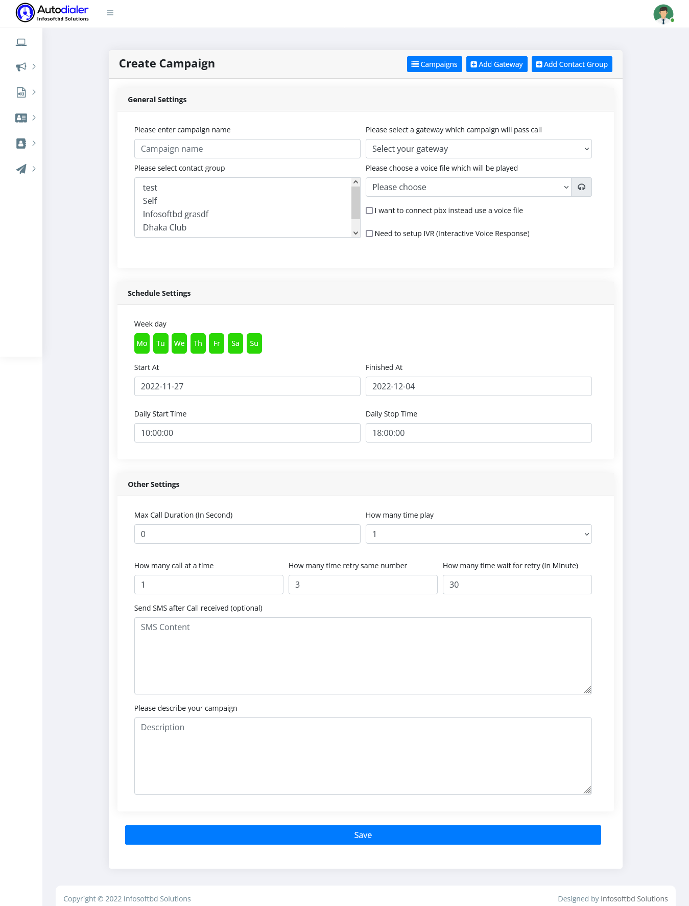
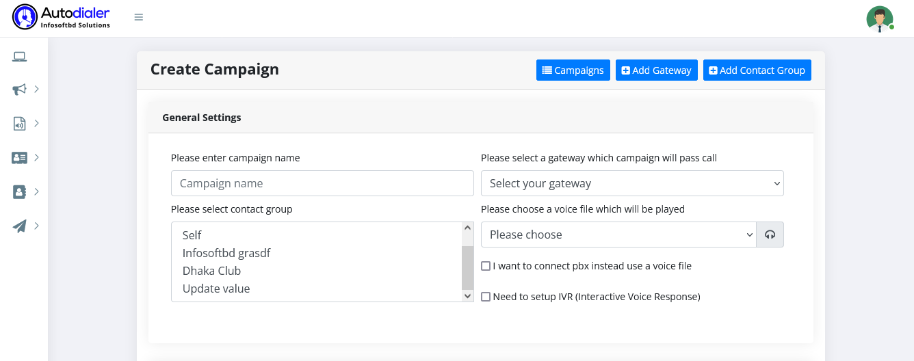
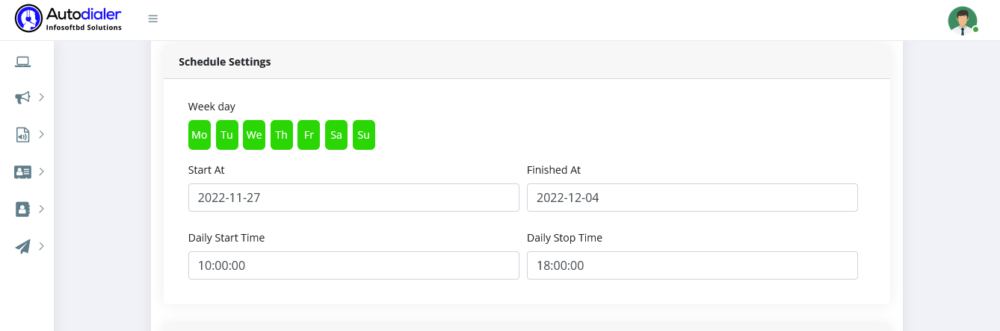
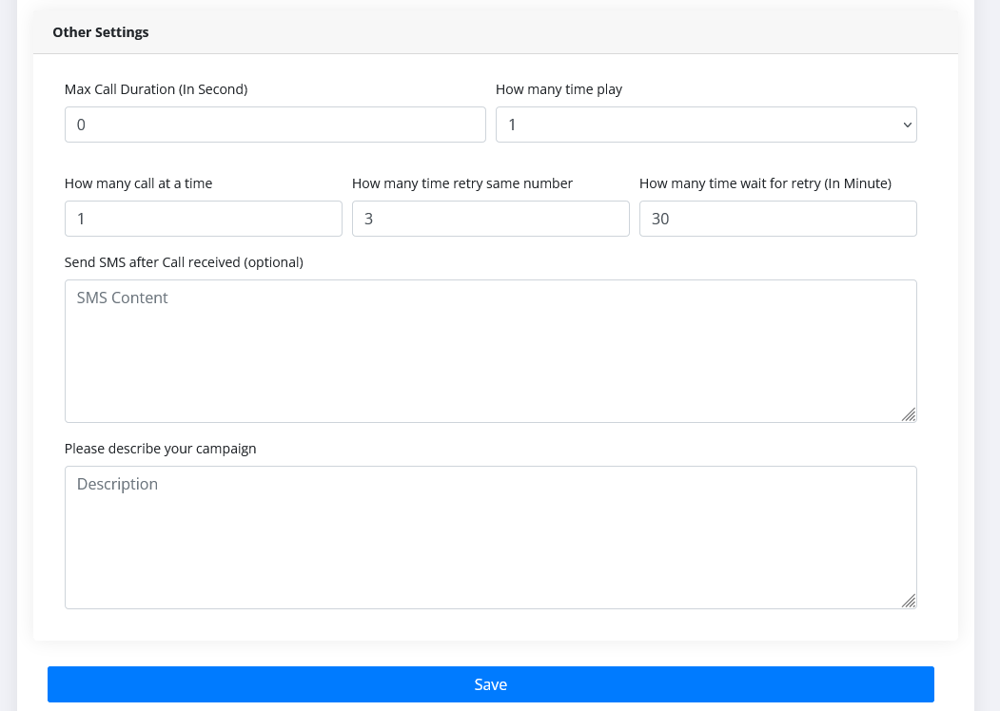

## Campaign management

>Campaign  for Add/Edit and manage campaign schedule

**Add Campaign:**
To create a new campaign first goto **Campaigns -> Add Campaigns**. Our autodialer can deliver a personal call, leave an answering machine message in your own voice, or generate a voice call. Our auto dialer collects touch-tone responses for press-1 campaigns in order to connect calls to agents, automatically opt-out, confirm, and much more.

By clicking on any campaign, you can see the details of the campaign and whether the scheduling campaign information is correct.
<!-- 
 -->

**What are the steps in campaign processing?**

To create any campaign, first fill up the general settings, such as a new campaign name, select a voice gateway, select a recorded voice and contact group, and check PBX and IVR settings.

To create any campaign, then fill up the  Schedule Settings, such as a new campaigning time and schedule, Starting time, ending time and much more.

To create a campaign, fill out the Other Settings with the following information: max call duration, how much time to play a call, channel setting, if one number does not reach the destination, how much time to retry to reach the destination, how much time to call again, and setting an SMS notification for ending the call. 

You will get to edit or update your campaign as needed. Just go to the campaign list and click the edit button to update the campaign before starting it. If a campaign is running, there is no option to edit or update the campaign.