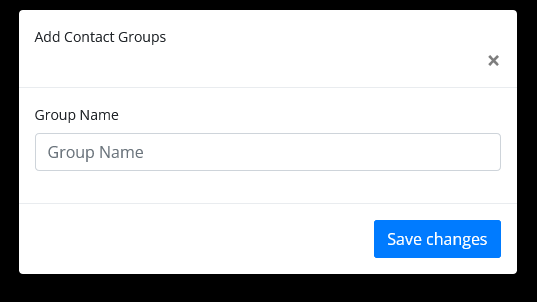

# Contact Group Add/Edit

- To access your contacts and contact groups, choose an option:
-  click the add contact group button and then Contacts.
- (Optional) Click a contact group to view their details, such as email address, phone number, or a directory profile.

# Update a contact from a group

- In Contacts on autodialer, click the group that contains the contact you want to updated.

- Click the contact, then press the edit button you can update any contact group.

# Remove a contact from a group

- In Contacts on autodialer, click the group that contains the contact you want to remove.

- Click the contact, then press the Delete key.

