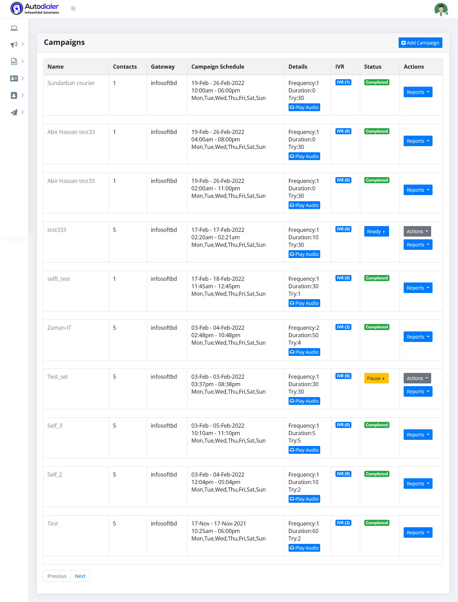

# Campaign Management

> Customer support has become a key component for brands wishing to stand out in the competition. Consumers like to collaborate with brands that are quick to respond. This is why your company, especially that are scaling with a vast customer base must incorporate inbound call center to deliver outstanding customer experience.

An Inbound Call Center Campaign is a marketing campaign that focuses on agents dealing with customer and their needs over incoming calls.
The goal of an inbound call center campaign is to address customers’ needs, increase foot traffic, and improve customer satisfaction.

**Find The Best Call Center Software For Your Business?**

Call center software allows companies to target their campaigns more accurately. Finding the best call center software can be daunting. Call center software reviews and buyer’s guides are a good place to start. Call center software reviews can help you find the right software for your business.

But there are many software reviews online making it difficult to choose the best call center software without in-depth research.

For finding the best call center software, consider some of these factors as follows –

- Ease of use
- Cost per agent
- Features
- Integrations

After successfully creating a campaign, you can see a list of scheduled campaigns here.You can now manage your campaign as you see fit.First comes the campaign stage in a ready state, then trying, then running .You can pause the campaign within your schedule.

