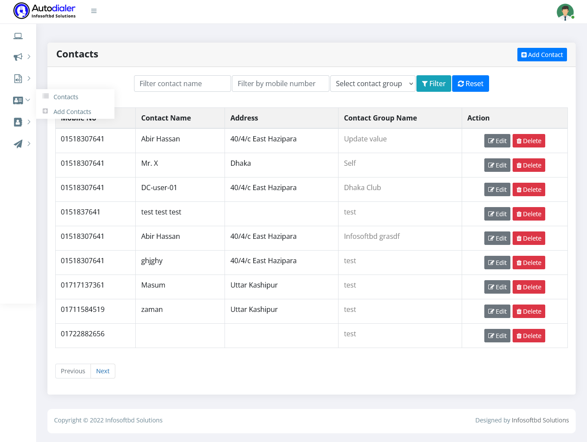

# Contact Infomation

>Manage an Voice SMS marketing list with thousands of mobile phone numbers in just a single clicks using Autodialer
 powerful control panel.

- Organise your contacts into lists:
	 sort all contacts in your database into different lists for sending targeted bulk voice messages.

- Control access to your lists:
	Use sub-accounts to provide different people within your organisation with access to different lists, while restricting access to others.

- Store an unlimited number of contacts:
	With Autodialer there are no limits to how many contacts you can store. You can create just one or even hundreds of lists for FREE.

- Add, edit, move & delete contacts
	It is easy to move contacts between lists and even easier to add or delete your contacts. You can even bulk delete all your contacts at once.

