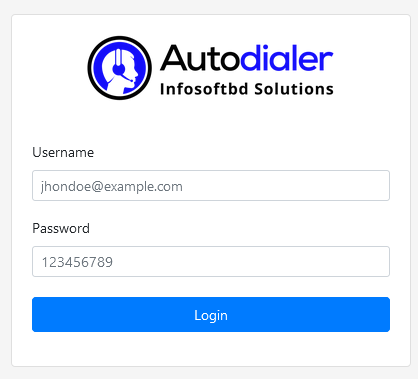
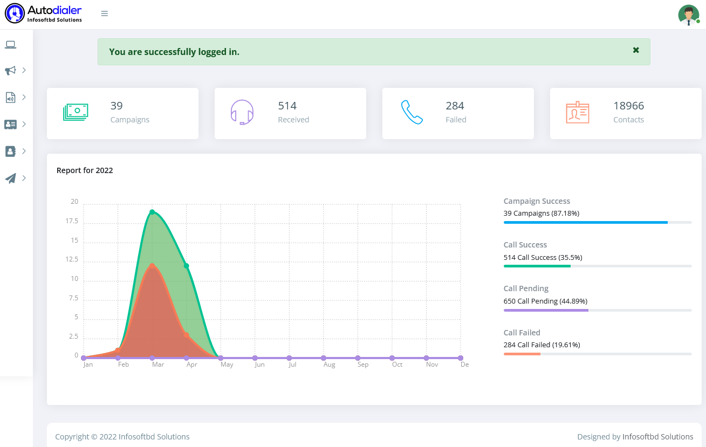

# Logging in to Autodialer

You can log in to your autodialer account using your internet browser on a desktop device, or a mobile device.

If you forget your account password, then you can reset your password. If you forget the email address then contact our  Support team.

**Steps:**

- Go to the  client login page. Like a https://autodialer.infosoftbd.com/client/

- Enter your email address that's  use one of the login services to log in.
- Enter your password, and then click Log in.
- If you have two-step authentication activated on your  account, then enter the authentication code using your authentication method, and then click Log in.

After successfully logging in, you can see a dynamic and beautiful dashborad for like a call center.

