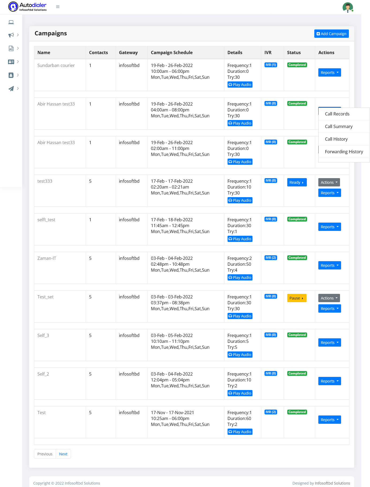
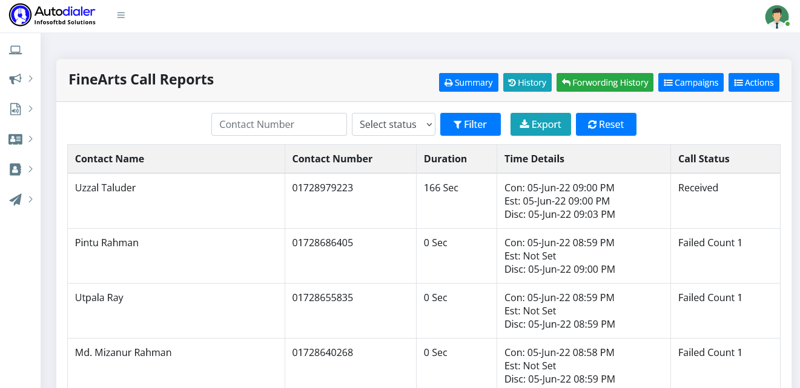
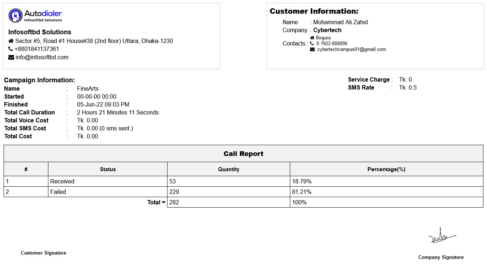
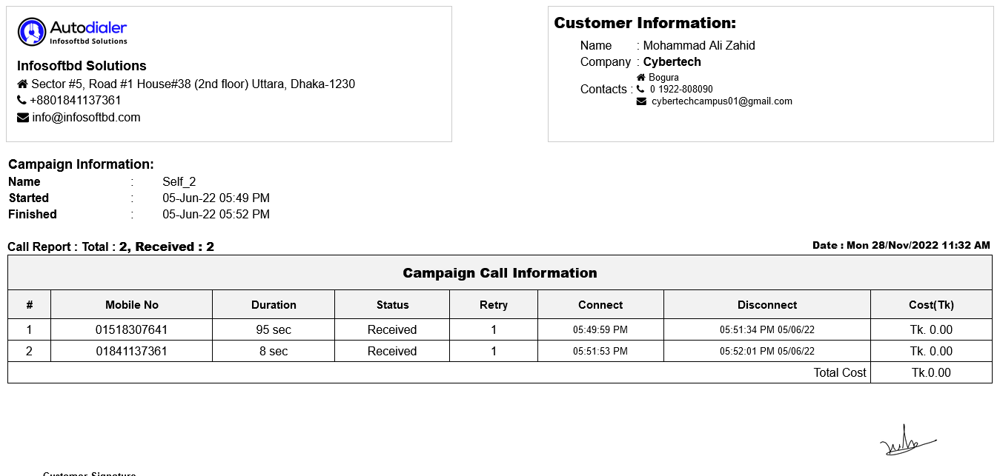
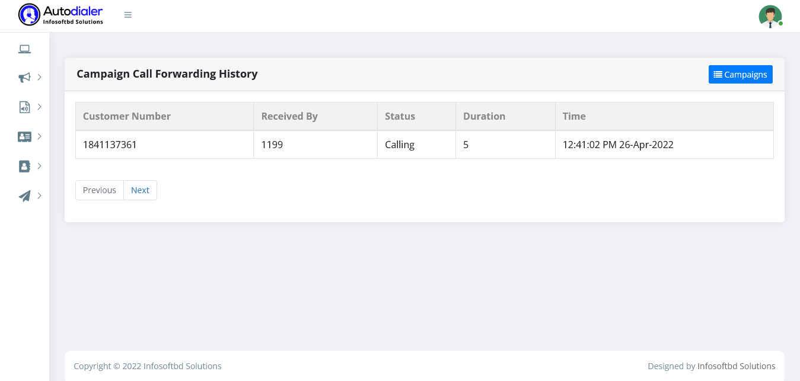

# Reports Documents 

>Customize and automate phone calls for any of your needs. Auto Dialer is your simple solution to outbound sales, telemarketing, and smart dialing.

**Call Records:**

Select a report section, then click on the call records option to see the call duration, call status, and call received date and time for each contact number.

**Call Summery:**

Select a report section, then click on the "Call Summary" option to see the successful call duration, failed call, call status, and start and end campaigns. Customer information and the call rate per minute, as well as the SMS rate, are also displayed. 

**Call History:**

Choose a report section, then click the "Call History" option to see the successful call duration, how long it takes to retry the same contact number, call status, call connect time, and disconnect time, as well as the total cost for each call. 

**Call Forwards History:**

Choose a report section, then click the "Call Forwards History" option to see the successful call forward duration,call status,call connect time, and disconnect time. 

