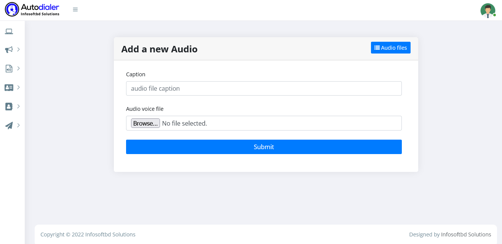

# Voice File Uploaded 

>Upload an audio file. Uploaded files can be played on calls or conferences.

- Step 1: Create your audio file. There are many ways you can accomplish this and as long as your file meets our file type(.WAV or MP3) and size requirements (see below), you can upload it.
- Step 2: Upload your audio file. You can use our easy-to-use upload form at the bottom of the page to upload your file to our system.
- Step 3: Now your file is ready to be Play campaign with the entire world! 

