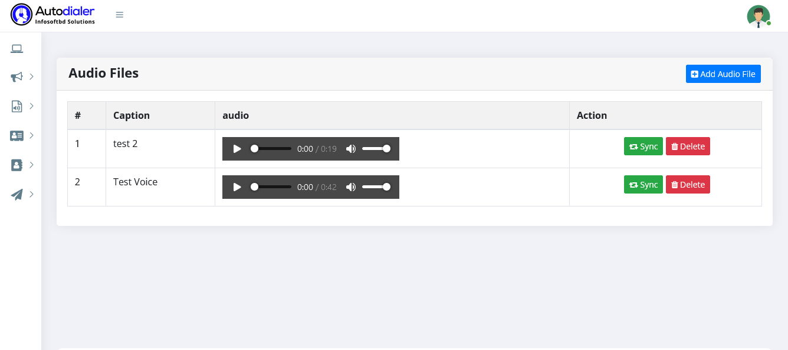

# Vocie File List

>All types of audio files are transferred between people and organizations. In personal situations, it could be voice recordings, songs, and music files. In a professional capacity, it can be things like voice-over customer communication to the company owner. 

The following is a list of candidate files for the running campaign. 

